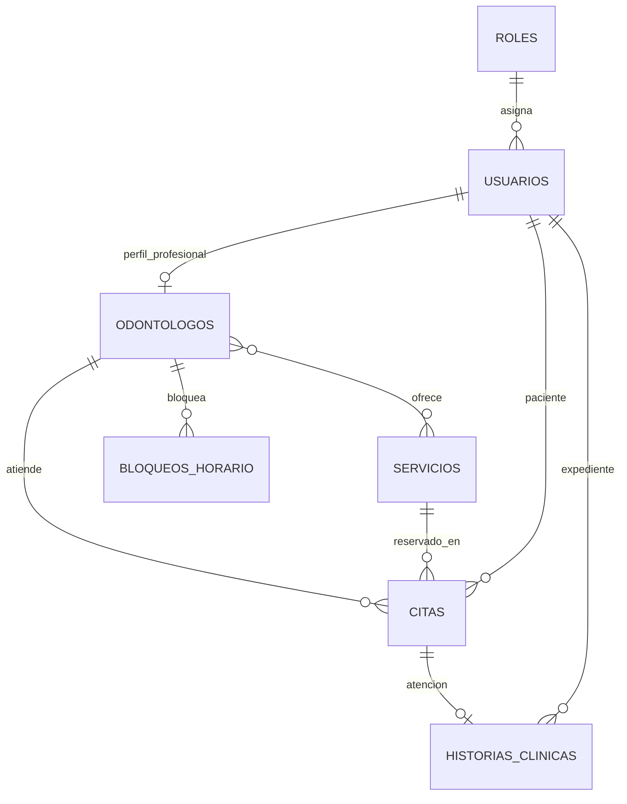

# SmartDent - Avance 2

## Unidad 2: modelo de datos, JPA/Hibernate, CRUD, JPQL, transacciones, Spring Security y JWT

### 3.1 Modelo de datos

SmartDent utiliza un modelo de datos relacional orientado a la gestion de citas odontologicas. El diseno permite registrar pacientes, odontologos, administradores, servicios clinicos, citas, historias clinicas, bloqueos de horario, mensajes de contacto y configuraciones de costos. La informacion se organiza en entidades relacionadas para mantener la trazabilidad entre el paciente, el profesional, el servicio reservado y la atencion realizada.

Las entidades principales del sistema son:

| Entidad | Tabla | Descripcion |
|---|---|---|
| Usuario | `usuarios` | Almacena pacientes, odontologos y administradores. Incluye datos personales, credenciales cifradas, rol y estado de cuenta. |
| Rol | `roles` | Define los permisos generales del usuario: ADMIN, ODONTOLOGO o PACIENTE. |
| Odontologo | `odontologos` | Contiene informacion profesional del odontologo, codigo interno, colegiatura, especialidad y relacion con servicios. |
| Servicio | `servicios` | Registra tratamientos odontologicos, precio, costo, duracion, especialidad, sesiones incluidas e imagen asociada. |
| Cita | `citas` | Gestiona reservas de pacientes con odontologos. Incluye fecha, hora, estado, servicio, precio pactado y control de sesiones. |
| HistoriaClinica | `historias_clinicas` | Registra diagnosticos, tratamientos, indicaciones, observaciones y proximo control del paciente. |
| BloqueoHorario | `bloqueos_horario` | Permite al odontologo bloquear rangos de horario para evitar reservas en tiempos no disponibles. |
| MensajeContacto | `mensajes_contacto` | Guarda consultas enviadas desde el formulario de contacto. |
| CostoFijoConfig | `costos_fijos_config` | Permite configurar costos administrativos para reportes financieros. |

Relaciones principales:

- Un usuario pertenece a un rol.
- Un odontologo esta asociado a un usuario.
- Un odontologo puede atender varios servicios.
- Una cita pertenece a un paciente, un odontologo y un servicio.
- Una historia clinica pertenece a un paciente y puede asociarse a una cita atendida.
- Un bloqueo de horario pertenece a un odontologo.



### 3.2 Implementacion con JPA e Hibernate

El backend de SmartDent utiliza Spring Data JPA e Hibernate para mapear clases Java hacia tablas de la base de datos. Cada clase de dominio se representa mediante `@Entity`, mientras que las claves primarias se generan con `@Id` y `@GeneratedValue(strategy = GenerationType.IDENTITY)`.

Ejemplos implementados:

- `Usuario`: mapea la tabla `usuarios`, valida unicidad de correo y DNI, y se relaciona con `Rol` mediante `@ManyToOne`.
- `Cita`: mapea la tabla `citas` y se relaciona con `Usuario`, `Odontologo` y `Servicio`.
- `Servicio`: mapea el catalogo de tratamientos, precios, costos, duracion y sesiones incluidas.
- `HistoriaClinica`: registra informacion clinica del paciente y su seguimiento.

Los repositorios extienden `JpaRepository`, lo que permite ejecutar operaciones CRUD sin escribir SQL manual para operaciones basicas:

```java
public interface CitaRepository extends JpaRepository<Cita, Long> {
    List<Cita> findByPaciente_EmailIgnoreCaseOrderByFechaDescHoraInicioDesc(String email);
}
```

La conexion a la base de datos se configura en `application.properties` mediante variables como `DB_URL`, `DB_USERNAME`, `DB_PASSWORD`, `DB_DRIVER` y `DB_DDL_AUTO`. En entorno local se utiliza MariaDB/MySQL de XAMPP.

### 3.3 CRUD implementado

SmartDent implementa operaciones CRUD y operaciones de negocio sobre los modulos principales del sistema:

| Modulo | Crear | Listar | Actualizar | Eliminar o cambiar estado |
|---|---:|---:|---:|---:|
| Usuarios | Si | Si | Si | Activar/inactivar |
| Servicios | Si | Si | Si | Activar/inactivar |
| Citas | Si | Si | Reprogramar | Cancelar/cambiar estado |
| Odontologos | Si | Si | Si | Activar/inactivar usuario |
| Historia clinica | Si | Si | Si | No aplica |
| Mensajes de contacto | Si | Si | Cambiar estado | No aplica |
| Bloqueos de horario | Si | Si | No aplica | Eliminar |

Endpoints representativos:

| Metodo | Endpoint | Funcion |
|---|---|---|
| POST | `/api/auth/registro` | Registrar paciente. |
| POST | `/api/auth/login` | Iniciar sesion y obtener token JWT. |
| GET | `/api/auth/perfil` | Obtener datos del usuario autenticado. |
| GET | `/api/servicios` | Listar servicios disponibles. |
| POST | `/api/admin/servicios` | Crear servicio desde el panel administrador. |
| PUT | `/api/admin/servicios/{id}` | Actualizar servicio. |
| PATCH | `/api/admin/servicios/{id}/estado` | Activar o inactivar servicio. |
| POST | `/api/pacientes/citas` | Reservar cita. |
| GET | `/api/pacientes/citas` | Listar citas del paciente. |
| PUT | `/api/pacientes/citas/{id}/reprogramar` | Reprogramar cita. |
| PATCH | `/api/pacientes/citas/{id}/cancelar` | Cancelar cita. |
| GET | `/api/odontologos/citas` | Listar agenda del odontologo. |
| PATCH | `/api/odontologos/citas/{id}/estado` | Cambiar estado de una cita asignada. |
| PUT | `/api/odontologos/historias-clinicas` | Guardar atencion clinica. |

### 3.4 Consultas JPQL

El sistema combina metodos derivados de Spring Data JPA con consultas JPQL personalizadas para resolver reglas de agenda. Las consultas JPQL se encuentran principalmente en los repositorios de citas, odontologos y bloqueos de horario.

Casos implementados:

- Validar cruces de horario del odontologo.
- Validar cruces de horario del paciente.
- Excluir una cita especifica al reprogramar.
- Buscar odontologo con bloqueo pesimista durante una reserva.
- Validar disponibilidad frente a bloqueos de horario.

Ejemplo de JPQL aplicado a la agenda:

```java
@Query("""
        select (count(c) > 0) from Cita c
        where c.odontologo.id = :odontologoId
          and c.fecha = :fecha
          and c.estado in :estados
          and c.horaInicio < :horaFin
          and c.horaFin > :horaInicio
        """)
boolean existeCruceOdontologo(
        @Param("odontologoId") Long odontologoId,
        @Param("fecha") LocalDate fecha,
        @Param("horaInicio") LocalTime horaInicio,
        @Param("horaFin") LocalTime horaFin,
        @Param("estados") Collection<CitaEstado> estados);
```

Esta consulta permite evitar que un odontologo tenga dos citas en el mismo rango horario.

### 3.5 Manejo de transacciones

Las operaciones criticas del sistema utilizan `@Transactional` para asegurar consistencia. Esto significa que, si una operacion falla durante el proceso, los cambios se revierten y no quedan datos incompletos.

Transacciones relevantes:

- Registro de pacientes.
- Creacion, reprogramacion y cancelacion de citas.
- Cambio de estado de citas.
- Registro de historia clinica.
- Bloqueo de horarios.
- Creacion y actualizacion de servicios.
- Registro de mensajes de contacto.

Ejemplo:

```java
@Transactional
public CitaResponse reservar(String emailPaciente, CrearCitaRequest request) {
    Usuario paciente = buscarPaciente(emailPaciente);
    Odontologo odontologo = buscarOdontologoActivoParaReserva(request.odontologoId());
    Servicio servicio = buscarServicioActivo(request.servicioId());
    validarCruces(paciente.getEmail(), odontologo.getId(), request.fecha(), request.horaInicio(), horaFin, null);
    return CitaResponse.desde(citaRepository.saveAndFlush(cita));
}
```

En la reserva de citas tambien se utiliza bloqueo pesimista sobre el odontologo para reducir el riesgo de reservas simultaneas sobre el mismo profesional.

### 3.6 Spring Security y JWT

SmartDent implementa autenticacion y autorizacion con Spring Security y JWT. El login valida las credenciales del usuario, genera un token firmado y lo utiliza para acceder a rutas protegidas.

Roles configurados:

- `ADMIN`: administra usuarios, servicios, citas, reportes, costos y mensajes.
- `ODONTOLOGO`: visualiza agenda, bloquea horarios y registra atenciones clinicas.
- `PACIENTE`: reserva citas, consulta su historial y actualiza configuracion personal.

Reglas principales de seguridad:

| Ruta | Acceso |
|---|---|
| `/api/auth/registro` | Publico |
| `/api/auth/login` | Publico |
| `/api/servicios/**` | Publico para consulta |
| `/api/admin/**` | Solo ADMIN |
| `/api/odontologos/**` | Solo ODONTOLOGO |
| `/api/pacientes/**` | Solo PACIENTE |

El token JWT incluye el rol del usuario y se envia en Postman o en el frontend mediante el encabezado:

```http
Authorization: Bearer {{token}}
```

Las contrasenas no se almacenan en texto plano, sino cifradas mediante `PasswordEncoder`.

## 5. Pruebas y evidencias

### 5.1 Casos de prueba funcionales

| Codigo | Caso de prueba | Entrada | Resultado esperado | Estado |
|---|---|---|---|---|
| CP-01 | Registrar paciente | Nombre, DNI, correo, telefono y contrasena validos | Paciente creado con rol PACIENTE | Aprobado |
| CP-02 | Evitar correo duplicado | Registro con correo existente | Error de duplicidad | Aprobado |
| CP-03 | Iniciar sesion | Credenciales validas | Token JWT y perfil del usuario | Aprobado |
| CP-04 | Consultar perfil | Token valido | Datos del usuario autenticado | Aprobado |
| CP-05 | Listar servicios | Solicitud GET publica | Lista de servicios activos | Aprobado |
| CP-06 | Crear servicio | Token ADMIN y datos validos | Servicio registrado | Aprobado |
| CP-07 | Actualizar servicio | Token ADMIN y datos actualizados | Servicio modificado | Aprobado |
| CP-08 | Reservar cita | Token PACIENTE, servicio, odontologo, fecha y hora | Cita pendiente registrada | Aprobado |
| CP-09 | Evitar cruce de horario | Cita en horario ocupado | Error de horario no disponible | Aprobado |
| CP-10 | Reprogramar cita | Nueva fecha y hora valida | Cita actualizada | Aprobado |
| CP-11 | Cancelar cita | Id de cita activa | Estado CANCELADA | Aprobado |
| CP-12 | Registrar atencion clinica | Token ODONTOLOGO y datos clinicos | Historia clinica guardada y cita atendida | Aprobado |
| CP-13 | Acceder sin token | Solicitud a ruta protegida sin JWT | Error 401 | Aprobado |
| CP-14 | Acceso con rol incorrecto | Token PACIENTE hacia ruta ADMIN | Error 403 | Aprobado |

### 5.2 Evidencias de Postman

Para el Avance 2 se recomienda incluir capturas de:

- Registro de paciente: `POST /api/auth/registro`.
- Inicio de sesion: `POST /api/auth/login`.
- Perfil autenticado: `GET /api/auth/perfil`.
- Listado de servicios: `GET /api/servicios`.
- Creacion o actualizacion de servicio: `POST /api/admin/servicios` o `PUT /api/admin/servicios/{id}`.
- Reserva de cita: `POST /api/pacientes/citas`.
- Listado de citas del paciente: `GET /api/pacientes/citas`.
- Agenda del odontologo: `GET /api/odontologos/citas`.
- Guardado de historia clinica: `PUT /api/odontologos/historias-clinicas`.
- Acceso no autorizado: ruta protegida sin encabezado `Authorization`.

La coleccion Postman sugerida se encuentra en:

`doc/postman/SmartDent_Avance_2.postman_collection.json`

### 5.3 Pruebas unitarias

El backend incluye pruebas unitarias con JUnit 5 y Mockito. Las pruebas se ejecutan sin iniciar el contexto completo de Spring y sin acceder a la base de datos, lo que permite validar la logica de negocio de forma aislada.

Grupos de pruebas implementadas:

- Registro de pacientes: creacion valida, normalizacion de datos, cifrado de contrasena y rechazo de correo o DNI duplicado.
- Autenticacion: generacion del JWT, consulta de perfil y rechazo de usuarios inactivos o inexistentes.
- CRUD de servicios: listado, creacion, actualizacion, cambio de estado y validacion de duplicados.
- Gestion de citas: cobro de la primera sesion, sesiones incluidas sin recobro y rechazo de domingos o cruces de horario.

Comando de ejecucion:

```powershell
cd backend
.\mvnw.cmd test
```

Resultado esperado:

```text
Tests run: 19, Failures: 0, Errors: 0, Skipped: 0
BUILD SUCCESS
```

## 6. Resultados

### 6.1 Lo logrado frente a lo planificado

| Planificado | Resultado logrado |
|---|---|
| Disenar el modelo de datos | Se implementaron entidades JPA para usuarios, roles, odontologos, servicios, citas, historias clinicas, mensajes y bloqueos. |
| Integrar persistencia con JPA/Hibernate | Se configuraron repositorios `JpaRepository`, relaciones entre entidades y persistencia en MySQL/MariaDB. |
| Implementar CRUD | Se implementaron CRUD y operaciones de negocio para servicios, citas, usuarios, odontologos, historial y mensajes. |
| Aplicar JPQL | Se agregaron consultas personalizadas para validar cruces de horario y disponibilidad. |
| Manejar transacciones | Se aplico `@Transactional` en reservas, reprogramaciones, historias clinicas y cambios de estado. |
| Implementar Spring Security y JWT | Se protegieron rutas por rol y se genero autenticacion basada en tokens. |
| Realizar pruebas | Se implementaron pruebas unitarias y se prepararon casos de prueba para Postman. |

### 6.2 Dificultades encontradas

- Configurar correctamente la conexion entre Spring Boot y MySQL/MariaDB.
- Definir reglas de seguridad por rol sin bloquear endpoints publicos necesarios.
- Validar cruces de horario entre citas y bloqueos.
- Evitar doble cobro cuando un tratamiento incluye varias sesiones.
- Mantener sincronizados los datos del frontend con la API REST.
- Organizar pruebas unitarias aisladas sin depender de la base de datos.

## 7. Conclusiones y recomendaciones

### 7.1 Conclusiones

- SmartDent evoluciono de una maqueta web a un sistema con backend funcional, persistencia y seguridad.
- JPA/Hibernate permitio modelar las tablas como entidades Java y reducir el uso de SQL manual en operaciones basicas.
- Las consultas JPQL permitieron resolver reglas propias del negocio, como la validacion de cruces de horario.
- Spring Security y JWT permitieron separar el acceso de administradores, odontologos y pacientes.
- Las pruebas unitarias ayudaron a validar reglas importantes sin depender de una base de datos activa.

### 7.2 Recomendaciones

- Implementar Angular en la siguiente etapa para reemplazar progresivamente la maqueta HTML/CSS/JS.
- Agregar migraciones controladas de base de datos con Flyway o Liquibase.
- Completar mas pruebas de seguridad y validacion de permisos por rol.
- Incorporar reportes mas detallados para administracion.
- Mejorar la gestion de pagos cuando el curso lo permita.

## 8. Referencias

Oracle. (2024). *Java Documentation*. https://docs.oracle.com/en/java/

Spring. (2024). *Spring Boot Reference Documentation*. https://docs.spring.io/spring-boot/

Spring. (2024). *Spring Security Reference*. https://docs.spring.io/spring-security/

Hibernate. (2024). *Hibernate ORM Documentation*. https://hibernate.org/orm/documentation/

JWT.io. (2024). *Introduction to JSON Web Tokens*. https://jwt.io/introduction

Postman. (2024). *Postman Learning Center*. https://learning.postman.com/

## 9. Anexos

### 9.1 Estructura tecnica del proyecto

```text
backend/
  src/main/java/pe/edu/utp/smartdent/
    config/
    controller/
    dto/
    entity/
    exception/
    repository/
    security/
    service/
  src/test/java/pe/edu/utp/smartdent/service/
maquetacion-html/
  css/
  img/
  js/
doc/
  postman/
  sql/
```

### 9.2 Codigo relevante

Archivos recomendados para capturar en anexos:

- `backend/src/main/java/pe/edu/utp/smartdent/entity/Usuario.java`
- `backend/src/main/java/pe/edu/utp/smartdent/entity/Cita.java`
- `backend/src/main/java/pe/edu/utp/smartdent/repository/CitaRepository.java`
- `backend/src/main/java/pe/edu/utp/smartdent/service/CitaService.java`
- `backend/src/main/java/pe/edu/utp/smartdent/config/SecurityConfig.java`
- `backend/src/test/java/pe/edu/utp/smartdent/service/CitaServiceUnitTest.java`

### 9.3 Scripts y colecciones

- Script de modelo referencial: `doc/sql/smartdent_modelo_datos.sql`.
- Coleccion Postman: `doc/postman/SmartDent_Avance_2.postman_collection.json`.
- Ejecucion de pruebas: `.\mvnw.cmd test`.

### 9.4 Enlace al repositorio

Repositorio del proyecto:

`https://github.com/xkelvin0/smartdent-web`
