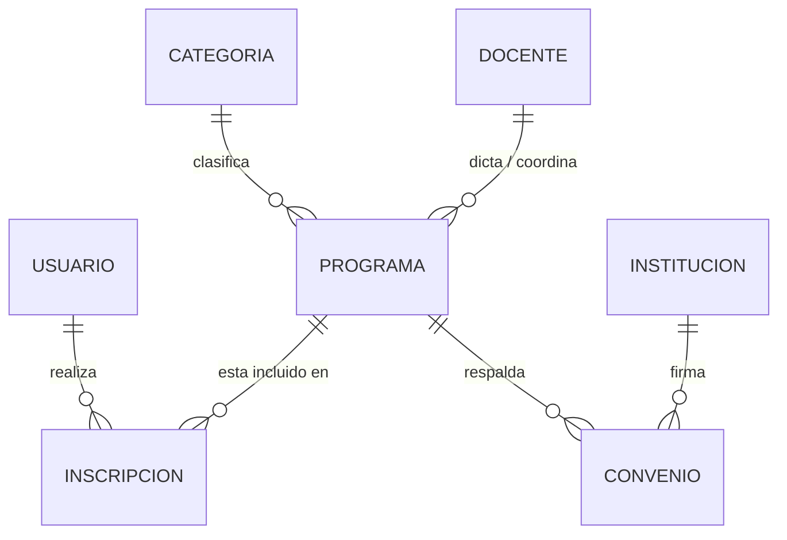

# 🎓 Guía de Preguntas y Respuestas para la Sustentación N° 01
**Curso:** Herramientas de Desarrollo (7mo Ciclo - UTP)  
**Proyecto:** Plataforma Web Institucional y Académica - Escuela Jurídica / SmartDent  
**Docente Evaluador:** Evaluación Sustentación N° 01  

---

## 📌 Temario Oficial de la Pizarra
1. **Lenguaje de Programación**
2. **Estructura de Programación**
3. **Base de Datos:** Entidad y Tipos de Relación (1:1, 1:N, N:M)
4. **HTML, CSS, JavaScript**
5. **Objetos (JavaScript / JSON)**
6. **Variable, Dato y Tipos de Datos**
7. **Repositorios:** Git y GitHub

---

## 🏛️ BLOQUE 1: Lenguaje de Programación

### ❓ P1. ¿Qué es un lenguaje de programación y qué tipos existen en el desarrollo web?
> **Respuesta Clave:**  
> Un **lenguaje de programación** es un conjunto formal de reglas sintácticas y semánticas que permite a los desarrolladores dar instrucciones precisas a una computadora para procesar datos, ejecutar algoritmos y resolver problemas.
>
> En el desarrollo web se dividen en:
> - **Lenguajes del lado del Cliente (Frontend):** Se ejecutan en el navegador del usuario (principalmente **JavaScript**, complementado por HTML para estructura y CSS para estilos).
> - **Lenguajes del lado del Servidor (Backend):** Se ejecutan en el servidor para lógica de negocio, autenticación y acceso a bases de datos (ej.: Node.js/JavaScript, Python, Java, PHP, C#).

---

### ❓ P2. ¿JavaScript es un lenguaje compilado o interpretado? ¿Cómo se ejecuta?
> **Respuesta Clave:**  
> JavaScript es un lenguaje **interpretado y compilado Just-In-Time (JIT)**. Los navegadores modernos (como el motor **V8** de Chrome y Edge) toman el código JavaScript, lo analizan (parsing), generan un árbol de sintaxis abstracta (AST) y lo compilan a código máquina en tiempo real para una ejecución de alto rendimiento.

---

### ❓ P3. ¿Cuál es la diferencia entre un lenguaje de programación y un lenguaje de marcado/estilos?
> **Respuesta Clave:**  
> - **HTML** no es un lenguaje de programación; es un **lenguaje de marcado** (*HyperText Markup Language*) que define la estructura y semántica del contenido mediante etiquetas. No tiene variables, bucles ni lógica.
> - **CSS** es un **lenguaje de hojas de estilo** (*Cascading Style Sheets*) que define la presentación visual (colores, espaciado, tipografía, layouts responsive).
> - **JavaScript** sí es un **lenguaje de programación completo**, con control de flujo, estructuras de datos, funciones, manipulación del DOM y asincronía.

```
+----------------------------------------------------------------+
| Estructura (HTML) + Estilo (CSS) + Comportamiento (JavaScript) |
| = Aplicación Web Completa                                      |
+----------------------------------------------------------------+
```

---

## ⚙️ BLOQUE 2: Estructuras de Programación

### ❓ P4. ¿Cuáles son las tres estructuras de programación fundamentales?
> **Respuesta Clave:**  
> Según el teorema de Böhm-Jacopini, todo algoritmo puede resolverse con:
> 1. **Estructura Secuencial:** Instrucciones que se ejecutan en orden lineal, una tras otra.
> 2. **Estructuras Condicionales (Selectivas):** Bifurcan el flujo de ejecución según una condición booleana (`if`, `else if`, `else`, `switch`, operador ternario `? :`).
> 3. **Estructuras Repetitivas (Iterativas / Bucles):** Ejecutan un bloque de código múltiples veces mientras se cumpla una condición (`for`, `while`, `do...while`, `forEach`, `map`, `filter`).

---

### ❓ P5. ¿Dónde se aprecian estas estructuras en nuestro proyecto? Muestra ejemplos concretos.
> **Respuesta Clave:**

#### 1. Condicionales en nuestro proyecto:
```javascript
// En script.js (control del menú responsive)
menuBtn.addEventListener('click', () => {
    mainNav.classList.toggle('open');
    const isOpen = mainNav.classList.contains('open');
    // Operador ternario (condicional)
    menuBtn.innerHTML = isOpen ? '<i class="fa-solid fa-xmark"></i>' : '<i class="fa-solid fa-bars"></i>';
});
```

#### 2. Iterativas / Bucles en nuestro proyecto:
```javascript
// En site-data.js (migración y filtrado de cursos y aliados)
const activePrograms = window.EJData.getPrograms()
    .filter(item => item.active) // Filtra activos
    .map(item => `              // Itera transformando cada objeto en HTML
        <div class="product-card">
            <h3>${item.title}</h3>
            <p>${item.description}</p>
        </div>
    `).join('');
```

#### 3. Control de límites (Módulo / Wraparound del Slider):
```javascript
// En script.js (cálculo de carrusel infinito)
function showSlide(index) {
    currentSlide = (index + slides.length) % slides.length;
}
```

---

## 🗄️ BLOQUE 3: Base de Datos: Entidad y Tipos de Relación

### ❓ P6. ¿Qué es una Entidad en bases de datos y cuáles son sus Atributos?
> **Respuesta Clave:**  
> - **Entidad:** Es cualquier objeto, persona, concepto o evento del mundo real sobre el cual se recolecta y almacena información en el sistema. En una base de datos relacional se traduce en una **tabla**.
> - **Atributo:** Son las propiedades, campos o características individuales que describen a la entidad (ej.: `id`, `nombre`, `correo`, `precio`).
> - **Clave Primaria (Primary Key - PK):** Atributo único que identifica de forma irrepetible a cada registro de la entidad.
> - **Clave Foránea (Foreign Key - FK):** Atributo que hace referencia a la PK de otra tabla para establecer una relación entre entidades.

---

### ❓ P7. ¿Cuáles son los tipos de relaciones en bases de datos y cómo se aplican a nuestro proyecto?
> **Respuesta Clave:**



#### 1. Relación Uno a Uno (1:1):
- **Concepto:** Un registro de la Tabla A se asocia exclusivamente con un solo registro de la Tabla B.
- **Ejemplo en el Proyecto:**  
  `USUARIO` (1) ↔ `PERFIL_DETALLE` (1)  
  *Un usuario del aula virtual tiene un único expediente académico.*

#### 2. Relación Uno a Muchos (1:N):
- **Concepto:** Un registro de la Tabla A se relaciona con varios registros de la Tabla B, pero cada registro de B solo pertenece a un único registro de A.
- **Ejemplo en el Proyecto:**  
  `CATEGORIA` (1) ↔ `PROGRAMA` (N)  
  *Una categoría (ej.: Diplomados) contiene muchos programas académicos, pero cada programa pertenece a una categoría principal.*  
  `INSTITUCION_ALIADA` (1) ↔ `CONVENIOS` (N)  
  *Una institución aliada (ej.: SUNARP) puede respaldar múltiples diplomados.*

#### 3. Relación Muchos a Muchos (N:M):
- **Concepto:** Múltiples registros de la Tabla A se asocian con múltiples registros de la Tabla B. Requiere una tabla intermedia asociativa.
- **Ejemplo en el Proyecto:**  
  `ALUMNO/USUARIO` (N) ↔ `INSCRIPCION` (Intermedia) ↔ `PROGRAMA` (M)  
  *Un alumno puede matricularse en varios cursos (Notarial, Saneamiento, Contratos), y un curso tiene muchos alumnos inscritos.*

---

### ❓ P8. ¿Cómo maneja nuestro proyecto la persistencia de datos en esta primera entrega?
> **Respuesta Clave:**  
> Para la entrega N° 01 (Frontend / Prototipado Avanzado), la persistencia se gestiona con la API de **`localStorage` del navegador** mediante el módulo centralizado [`site-data.js`](file:///c:/Users/kelvi/Documents/utp/7mo%20ciclo/Herramientas%20de%20desarrollo/Semana%202/lab/propuestas%20para%20el%20proyecto%20final/site-data.js) estructurado en formato **JSON**. Esto permite realizar operaciones **CRUD** (Crear, Leer, Actualizar, Borrar) en tiempo real desde el panel de administración sin recargar la página.

---

## 🌐 BLOQUE 4: HTML, CSS y JavaScript

### ❓ P9. ¿Qué rol cumple cada una de las 3 tecnologías fundamentales de la web?
> **Respuesta Clave:**

| Tecnología | Rol Principal | Componentes Clave en el Proyecto |
| :--- | :--- | :--- |
| **HTML5** | **Estructura y Semántica** | Etiquetas semánticas: `<header>`, `<nav>`, `<section>`, `<article>`, `<main>`, `<footer>`, `<iframe>` (videos de YouTube), inputs de formulario con validación nativa (`type="email"`, `required`). |
| **CSS3** | **Estilos y Responsive Design** | CSS Custom Properties (Variables de diseño `--color-primary`, `--navy-dark`), Flexbox para barras de navegación, CSS Grid para tarjetas de cursos y equipo, Media Queries (`@media (max-width: 768px)`), transiciones y animaciones. |
| **JavaScript** | **Lógica e Interactividad** | Manipulación del DOM, carrusel con autodesplazamiento y flechas de navegación, menú hamburguesa interactivo, sincronización con `localStorage`, filtros de catálogo en vivo. |

---

### ❓ P10. ¿Por qué es importante el HTML Semántico?
> **Respuesta Clave:**  
> 1. **Accesibilidad (a11y):** Los lectores de pantalla para personas con discapacidad visual interpretan la jerarquía correctamente.
> 2. **SEO (Posicionamiento en Buscadores):** Google indexa mejor el contenido identificado con `<h1>`, `<header>`, `<article>`, etc.
> 3. **Mantenibilidad y Estándar:** Facilita el trabajo en equipo al estructurar el código de manera lógica en lugar de usar `<div>` anidados indiscriminadamente.

---

### ❓ P11. ¿Cómo se logró el Responsive Design en la página?
> **Respuesta Clave:**  
> 1. **Meta Viewport:** `<meta name="viewport" content="width=device-width, initial-scale=1.0">` en el `<head>`.
> 2. **Layouts Flexibles:** Uso de CSS Grid (`grid-template-columns: repeat(auto-fit, minmax(280px, 1fr))`) y Flexbox.
> 3. **Media Queries:** Reglas en `style.css` a partir de breakpoints estándar (768px y 480px) para reorganizar columnas a una sola fila, ajustar fuentes y convertir el menú horizontal en menú desplegable móvil.

---

## 📦 BLOQUE 5: Objetos en JavaScript

### ❓ P12. ¿Qué es un Objeto en JavaScript y cómo está construido?
> **Respuesta Clave:**  
> Un **objeto** es una estructura de datos que almacena una colección de pares **clave-valor** (*key-value*). Las claves son cadenas y los valores pueden ser datos primitivos, otros objetos, arreglos o funciones (denominadas métodos).

**Ejemplo extraído de nuestro archivo [`site-data.js`](file:///c:/Users/kelvi/Documents/utp/7mo%20ciclo/Herramientas%20de%20desarrollo/Semana%202/lab/propuestas%20para%20el%20proyecto%20final/site-data.js):**
```javascript
const programa = {
    id: 1,                                       // number
    type: "Diplomado",                           // string
    hours: "120 hrs",                            // string
    title: "Diplomado en Derecho Notarial y Registral",
    description: "Especialízate en trámites de escrituras públicas...",
    image: "img/curso1.jpg",                     // ruta local de imagen
    active: true                                 // boolean
};
```

---

### ❓ P13. ¿Qué es JSON y cómo se convierte un objeto a texto y viceversa?
> **Respuesta Clave:**  
> **JSON** (*JavaScript Object Notation*) es un formato ligero de intercambio de datos basado en texto.
> - `JSON.stringify(objeto)`: Convierte un objeto o arreglo de JavaScript a una cadena de texto JSON (útil para guardar en `localStorage` o enviar al backend).
> - `JSON.parse(textoJSON)`: Convierte una cadena de texto JSON a un objeto JavaScript para poder acceder a sus propiedades (`data.title`, `data.price`).

```javascript
// Guardar en localStorage
localStorage.setItem('ej_programs', JSON.stringify(programsArray));

// Leer y parsear desde localStorage
const guardados = JSON.parse(localStorage.getItem('ej_programs'));
```

---

## 🔢 BLOQUE 6: Variables, Datos y Tipos de Datos

### ❓ P14. ¿Cuál es la diferencia entre `var`, `let` y `const` en JavaScript moderno?
> **Respuesta Clave:**

| Característica | `var` (Antiguo ES5) | `let` (Moderno ES6+) | `const` (Moderno ES6+) |
| :--- | :--- | :--- | :--- |
| **Alcance (Scope)** | Función o global | Bloque `{ ... }` | Bloque `{ ... }` |
| **Reasignación** | Permitida | Permitida | **No permitida** |
| **Redeclaración** | Permitida (causa bugs) | Error de sintaxis | Error de sintaxis |
| **Hoisting** | Se eleva con valor `undefined` | Temporal Dead Zone | Temporal Dead Zone |

> **Buenas Prácticas:** En nuestro proyecto se utiliza **`const` por defecto** para referencias inmutables (elementos del DOM, módulos, arrays de datos) y **`let` únicamente cuando el valor cambiará** (índice del slider actual, contadores). Se evita completamente `var`.

---

### ❓ P15. ¿Cuáles son los tipos de datos en JavaScript?
> **Respuesta Clave:**

1. **Tipos Primitivos (Inmutables, pasan por valor):**
   - **`string`**: Cadenas de texto (`"Diplomado"`, `'img/curso1.jpg'`).
   - **`number`**: Enteros y decimales (`120`, `49.90`, `NaN`).
   - **`boolean`**: Valores de verdad (`true`, `false`).
   - **`null`**: Ausencia intencional de valor.
   - **`undefined`**: Variable declarada pero aún no asignada.
   - **`symbol`** y **`bigint`**: Tipos avanzados de ES6+.
2. **Tipos Complejos / Objetos (Pasan por referencia):**
   - **`Object`**: Colección de propiedades (`{ name: "UTP", cycle: 7 }`).
   - **`Array`**: Lista ordenada de elementos (`['slide1.jpg', 'slide2.jpg']`).
   - **`Function`**: Bloque ejecutable reutilizable (`function showSlide() { ... }`).

---

## 🚀 BLOQUE 7: Repositorios (Git y GitHub)

### ❓ P16. ¿Cuál es la diferencia entre Git y GitHub?
> **Respuesta Clave:**  
> - **Git:** Es un **sistema de control de versiones distribuido (software local)** instalado en la computadora. Registra el historial de cambios en los archivos, permite crear ramas, volver a versiones anteriores y fusionar código.
> - **GitHub:** Es una **plataforma en la nube** que aloja repositorios remotos de Git. Proporciona interfaz gráfica, colaboración en equipo, control de accesos, pull requests, despliegue continuo (GitHub Pages) y gestión de proyectos.

---

### ❓ P17. ¿Cuáles son los comandos de Git utilizados en el proyecto y qué hace cada uno?
> **Respuesta Clave:**

```powershell
# 1. Inicializar el repositorio local
git init

# 2. Renombrar la rama principal a main (estándar actual)
git branch -M main

# 3. Preparar archivos para el commit (Staging Area)
git add .

# 4. Crear una instantánea con mensaje descriptivo
git commit -m "feat: Avance N01 Escuela Juridica - maquetacion completa con imagenes locales y catalogo de cursos"

# 5. Vincular el repositorio local con el repositorio remoto de GitHub
git remote add origin https://github.com/xkelvin0/smartdent-web.git

# 6. Subir los cambios a la nube en la rama main
git push -u origin main

# 7. Consultar el estado del árbol de trabajo
git status

# 8. Ver el historial de commits
git log --oneline
```

---

### ❓ P18. ¿Qué es el ciclo de vida de un archivo en Git (Los 3 Estados)?
> **Respuesta Clave:**  
> 1. **Working Directory (Directorio de Trabajo):** Archivos modificados sin registrar.
> 2. **Staging Area / Index (`git add`):** Archivos seleccionados y preparados para ser guardados en el próximo commit.
> 3. **Repository / Git Directory (`git commit`):** Archivos guardados permanentemente en la base de datos de historial de Git (.git).
> 4. **Remote Repository (`git push`):** Código sincronizado con GitHub en la nube.

---

## 🎯 BLOQUE 8: Preguntas Específicas del Proyecto (Demostración en Vivo)

### ❓ P19. ¿Cómo funciona el Carrusel / Slider de la cabecera?
> **Respuesta Clave:**  
> El slider en [`script.js`](file:///c:/Users/kelvi/Documents/utp/7mo%20ciclo/Herramientas%20de%20desarrollo/Semana%202/lab/propuestas%20para%20el%20proyecto%20final/script.js) maneja 3 diapositivas locales (`slide1.jpg`, `slide2.jpg`, `slide3.jpg`).
> - Utiliza una clase CSS `.active` con opacidad y transición suave.
> - Dispone de un temporizador automático con `setInterval()` cada 6 segundos.
> - Cuenta con botones anterior (`#slidePrev`) y siguiente (`#slideNext`), además de puntos indicadores interactivos (`.dot`) con eventos `click`.

---

### ❓ P20. ¿Por qué las imágenes ahora se guardan localmente en lugar de usar URLs externas?
> **Respuesta Clave:**  
> Para asegurar la **alta disponibilidad**, rapidez de carga sin depender de conexión a servidores de terceros (como Unsplash), evitar bloqueos de CORS o caídas de enlaces externos, y garantizar que la plataforma sea 100% autónoma y portable.

---

## 💡 Consejos para la Sustentación
1. **Seguridad y Vocabulario Técnico:** Utiliza términos como *"manipulación del DOM"*, *"maquetación semántica"*, *"responsividad con CSS Grid"*, *"persistencia con JSON"* y *"control de versiones con Git"*.
2. **Demostración en Vivo:** Abre la consola de desarrollador del navegador (F12) y muestra el `localStorage` en la pestaña *Application* para impresionar al profesor con la reactividad de los datos.
3. **Muestra el Repositorio:** Ten abierta la pestaña de GitHub (`https://github.com/xkelvin0/smartdent-web`) demostrando que los commits están al día en la rama `main`.
