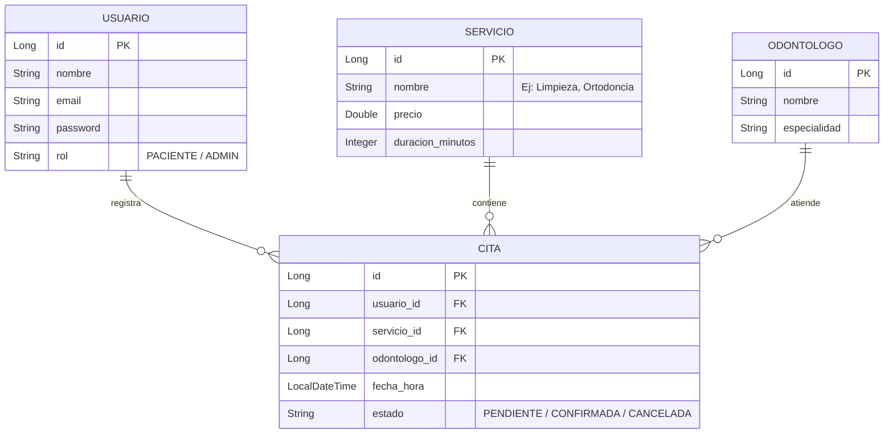

# Proyecto: Sistema Web de Gestión de Citas y Pacientes (SmartDent) 🦷

¡Felicidades, alumno! Ya tenemos el proyecto oficial aprobado para tu grupo. Como tu profesor, voy a guiarte para estructurar esto paso a paso. 

Aquí tienes la arquitectura inicial, las tablas de la base de datos y la planificación para que lo presentes a tu docente y empiecen con paso firme.

---

## 1. Planteamiento del Problema y Solución
* **Problema:** La clínica odontológica "SmartDent" realiza el agendamiento de citas de forma manual o vía WhatsApp, lo cual genera cruces de horarios, pérdida de tiempo y falta de historial clínico consolidado para los odontólogos.
* **Solución:** Un sistema web interactivo donde los pacientes puedan registrarse, ver los tratamientos y agendar su propia cita de forma autónoma. Los odontólogos y la recepcionista contarán con un panel de control para organizar la agenda y ver el historial de los pacientes.

---

## 2. Modelo de Base de Datos (Inicial)
Para mantenerlo profesional pero simple de implementar, usaremos estas **4 tablas principales**:

---

## 3. Endpoints a implementar (API REST en Spring Boot)
Estas son las "puertas" (rutas) que tu backend ofrecerá al frontend en Angular:

### 🔓 Públicos / Pacientes (Sin seguridad compleja al inicio)
* `POST /api/auth/registro` -> Registrar una nueva cuenta de paciente.
* `POST /api/auth/login` -> Iniciar sesión y recibir token de seguridad (JWT).
* `GET /api/servicios` -> Listar todos los tratamientos y precios disponibles.
* `GET /api/odontologos` -> Listar el staff de doctores.
* `POST /api/citas` -> Reservar una nueva cita.
* `GET /api/citas/paciente/{id}` -> Ver el historial de citas del paciente logueado.

### 🔒 Administrativos (Solo para Recepción / Doctores)
* `GET /api/admin/citas` -> Ver todas las citas agendadas (agenda global).
* `PUT /api/admin/citas/{id}/estado` -> Cambiar estado de cita (Ej: Confirmar, Cancelar).
* `POST /api/admin/servicios` -> Agregar un nuevo tratamiento al catálogo.

---

## 4. Cronograma de Desarrollo (Alineado a tus clases)

* **Fase 1 (Semanas 1 - 5):** Estructura del proyecto en Spring Boot, creación de controladores (`Controller`), servicios (`Service`) y pruebas unitarias (TDD).
* **Fase 2 (Semanas 6 - 10):** Conexión a Base de Datos (MySQL/PostgreSQL) con JPA/Hibernate y seguridad con JWT (Roles: Paciente y Admin).
* **Fase 3 (Semanas 11 - 18):** Frontend en Angular (pantallas de reserva, calendario y login) y despliegue final.

---

## 5. División del Trabajo para el Avance 1 (Solo HTML, CSS y JS)

Como el primer avance consiste únicamente en maquetar el frontend con **HTML5, CSS3 y JavaScript vanilla** (sin base de datos ni frameworks por ahora), dividiremos el trabajo de forma modular por pantallas. 

Para que el sitio no parezca un Frankenstein (donde cada pantalla tiene colores y estilos distintos), les propongo esta organización:

### 🎨 Integrante 1: Diseñador UI/UX & Estilos Globales
*Su misión es definir el look del sitio y hacer la página principal.*
* **Tareas:**
  * Crear la Landing Page principal (`index.html`): Banners, información de la clínica, testimonios de pacientes y footer.
  * Crear el archivo de estilos global (`estilos.css`) que usarán todos los demás integrantes. Debe definir la paleta de colores (ej. azul clínico, blanco, gris claro), la tipografía (Google Fonts como Inter o Roboto) y el estilo de los botones para que todo sea uniforme.

### 🔑 Integrante 2: Módulo de Autenticación (Acceso)
*Su misión es crear las pantallas para que los usuarios entren al sistema.*
* **Tareas:**
  * Crear la pantalla de Login (`login.html`) y de Registro (`registro.html`).
  * Escribir un archivo JavaScript (`auth.js`) para validar los formularios (por ejemplo, que el email tenga un formato correcto `@` y que las contraseñas coincidan al registrarse).
  * Simular con JS el inicio de sesión (redirigir al panel del paciente al hacer clic en "Ingresar").

### 📅 Integrante 3: Módulo del Paciente (Agendamiento)
*Su misión es crear el panel donde el cliente interactúa con la clínica.*
* **Tareas:**
  * Crear la vista de citas del paciente (`paciente.html`): Una pantalla donde el paciente pueda ver sus citas programadas anteriores.
  * Crear el formulario de reserva (`reservar.html`): Campos para elegir el tratamiento (limpieza, extracción), seleccionar un odontólogo, y elegir fecha y hora.
  * Escribir JS para que al "guardar" la cita, se añada a una lista simulada en pantalla.

### 💼 Integrante 4: Módulo de Administración (Dashboard)
*Su misión es crear la vista para la secretaria o los doctores.*
* **Tareas:**
  * Crear la vista administrativa (`admin.html`): Una tabla o lista que muestre todas las citas agendadas por los pacientes.
  * Crear botones interactivos en JS para simular "Confirmar" o "Cancelar" una cita de la tabla (cambiando visualmente el color del estado de la cita).
  * Crear filtros sencillos (por ejemplo, buscar citas por nombre de paciente o por fecha).

---

### Siguiente Paso de Repaso 🏋️‍♂️
Como estamos en la **Semana 2**, nuestro objetivo es crear los primeros Controladores simulados (sin base de datos real aún, solo respondiendo textos o datos ficticios). 

¿Qué te parece si creamos el controlador de Servicios (`ServicioController.java`) para simular que devolvemos la lista de tratamientos de la clínica? Dime si estás listo y te paso las instrucciones.
